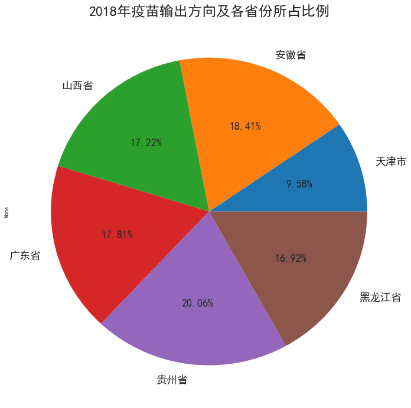

## 长春长生疫苗数据可视化（并非完全数据）


```python
import pandas as pd
import numpy as np
import matplotlib as mpl
import seaborn as sns
import os
% matplotlib inline
```


```python
mpl.rcParams['font.sans-serif'] = ['simhei']
mpl.rcParams['font.serif'] = ['simhei']
sns.set_style('darkgrid', {'font.sans-serif':['simhei','mono']})
```

### 与此次事件有关的省份


```python
df = pd.DataFrame()
for filename in os.listdir('csv'):
    tmp_df = pd.read_csv('csv/{}'.format(filename))
    df = df.append(tmp_df)
```


```python
ax = df.groupby('prov').count()['name'].sort_values().plot.barh(figsize=(14,8), fontsize=16)
ax.set_title("波及省份及疫苗批次", fontsize=24)
ax.set_xlabel("批次", fontsize=18)
ax.set_ylabel("省份", fontsize=18);
```


```python
df.groupby(['name']).size().count()
```


    209


2016年到2018年共有209种疫苗销往各个省市。


```python
ax = df.groupby(['name']).size().sort_values(ascending=False)[20:0:-1].plot.barh(figsize=(14,10), fontsize=16)
ax.set_title('输出批次前20的疫苗', fontsize=24)
ax.set_xlabel('疫苗输出批次',fontsize=18)
ax.set_ylabel('疫苗名称', fontsize=18);
```


```python
ax = df.groupby(['name']).size().sort_values(ascending=False)[40:0:-1].plot.barh(figsize=(14,20), fontsize=16)
ax.set_title('输出批次前40的疫苗', fontsize=24)
ax.set_xlabel('疫苗输出批次',fontsize=18)
ax.set_ylabel('疫苗名称', fontsize=18);
```


```python
ax = df.groupby(['src']).size().plot.pie(figsize=(10,10), fontsize=16, autopct='%.2f%%')
ax.set_title('国产疫苗与进口疫苗占比情况', fontsize=24);
```


```python
ax = df.groupby(['year']).size().plot.pie(figsize=(10,10), fontsize=16, autopct='%.2f%%')
ax.set_title('国产疫苗与进口疫苗占比情况', fontsize=24);
```


```python
ax=df[df['year']==2016].groupby(['prov'], as_index=False).size().plot.pie(autopct='%.2f%%', figsize=(12,12), fontsize=18)
ax.set_title('2016年疫苗输出方向及各省份所占比例', fontsize=24);
```


```python
ax = df[df['year']==2017].groupby(['prov'], as_index=False).size().plot.pie(autopct='%.2f%%', figsize=(12,12), fontsize=18)
ax.set_title('2017年疫苗输出方向及各省份所占比例', fontsize=24);
```


```python
ax = df[df['year']==2018].groupby(['prov'], as_index=False).size().plot.pie(autopct='%.2f%%', figsize=(12,12), fontsize=18)
ax.set_title('2018年疫苗输出方向及各省份所占比例', fontsize=24);
```




